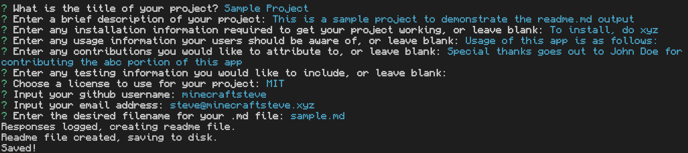
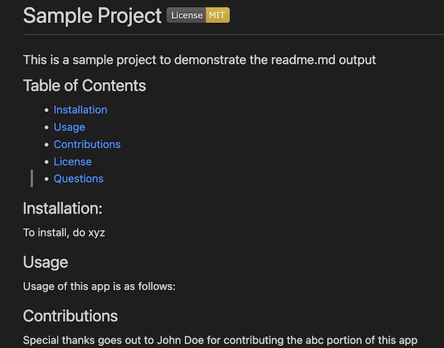

# Readme Generator
### A simple time-saving script

This repository is for a readme generation project made for my UC Berkeley coding bootcamp. It ouputs a pre-formatted readme.md file based on user input, making it quicker and easier to create readmes without unnecessary boilerplate.

The CLI flow looks something like this:

The final output for which would appear as:

A video walkthrough is available [here](https://drive.google.com/file/d/1KD0fTXxCnHwmN51cZ9DuGGNdI1U9VeqM/view?usp=sharing).

There is no license for this project and it is intended for educational purposes only.